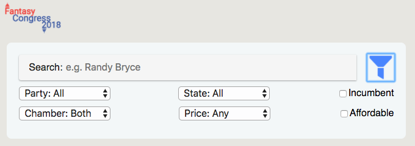

# Fantasy Congress 2018

The way the mainstream media covers Elections in this day in age leads to stories that only focus on the loudest and most outspoken members of either party being heard. This makes tracking Congressional Elections boring at best, because you keep hearing about the same races and the crazy thing that particular candidate said or did today. The Fantasy Congress 2018 App is designed to challenge users to dig into the data and narratives of lesser known races around the country and find the candidates destined to outperform expectations on Election Day 2018.

Operating under a similar model to Daily Fantasy Sports, once a user creates a profile they will be given $200 of fantasy money to allocate however they choose in order to fill a roster of 4 Senate Candidates and 8 House Candidates. The individual candidates will be priced based on their projected success, so the user won't be able to fill a team with 10 candidates running unopposed. Instead they will have to dig into all the resources at their disposal looking at races all across the country in order to figure out how they can put together the best possible team with their fantasy financial constraints.

As they look to put together their team, users will be able to search for a specific candidate, or filter the candidate list by various constraints (party, chamber, state, incumbent, price, or affordability). With one click the user can add a candidate to their team. If however a team becomes too expensive, a user can also easily drop a candidate from their team as well. Once a user has a full roster of 4 Senate Candidates and 8 House Candidates without going over budget, the user can submit their roster.

Live Site: https://fantasycongress2018.netlify.com/

## Screenshots

Landing Page:
----------------------------------------------------------------------------------------------

Candidates Search:
----------------------------------------------------------------------------------------------

Filter Options:
----------------------------------------------------------------------------------------------

Team Page:
----------------------------------------------------------------------------------------------

## Components Rundown

The app's landing page is the traditional log in page with the original Fantasy Congress 2018 Logo. Users can easily create an account through the Registration Page or if they already have one, quickly log in and be taken to the Landing Page.

The Landing Page has three main components, the Header that contains the logo thumbnail and log out button, and then the Candidates and Team Page components that divide the body of the app in half. The Candidates page has all of the candidates running for congress as well as a Search Bar and hidden Filter features that are only revealed if the user chooses. The Team Page has all of the slots a user needs to fill on their roster as well as an active tracker on the amount of their budget they have remaining.

Individual candidates can also be selected for a candidate view that gives more information about that candidate.

## Technology Stack

FrontEnd: React

State Management: Redux

BackEnd: NodeJS, Express, Passport, JWT, Bcrypt

Database: MongoDB, Mongoose

## What's next for Fantasy Congress 2018?

This challenge is meant to be played among your friends, so anyone can set up a league and invite their friends to play. Up until election night on the LEAGUE VIEW all you'll be able to see is who is in your league, what their team name is, and whether or not your friend has submitted their roster. Once they're locked in at midnight on November 6th, 2018 (ELECTION DAY!) you can see all everyones' teams by navigating from the LEAGUE VIEW.

The scoring system is simple. One percent of the electorate is equal to 1 point (i.e. a candidate who receives 47.6% of the votes in their district earns the user 47.6 points). The team with the most points once all the votes are tallied wins!

We're also in the process of beefing up the Candidate View. By plugging into the Twitter API we are working on allowing users to hear directly from candidates by viewing their recent tweets, as well as taking advantage of the Google News API to see recent articles about the candidate.

** NOTE: The current demo is done with 2016 Candidate Data. The database will be updated throughout Primary Season as the 2018 Candidate Field starts to take shape.
